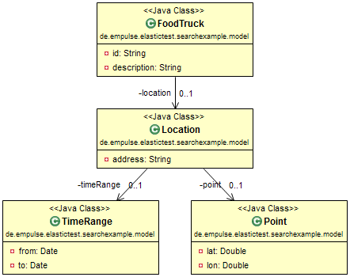

elasticsearchtest
=================

Testproject for discussing nested search with spring-data-elasticsearch, see [Stackoverflow Discussion](
http://stackoverflow.com/questions/21778849/spring-data-elasticsearch-unsing-criteria-with-nested-objects)

#Preferences
- Java 1.7
- Maven 3

#Introduction
In this simple example we have a FoodTruck which is in a certain place in a certain time:

#Service explanation
We tried two different implementations using spring-data-elasticsearch: Criterias and QueryBuilders.

Criteria queries are only for simple cases and are not approriate for nested queries!

Additionally we used Spring Java Configuration which starts an embedded Elasticsearch instance.

Just run the JUnit test FoodTruckServiceImplTest.

#What works / not works
Currently the LIKE search for description in FoodTruck works.

The search by TimeRange works.

The search geo_distance in location does not work.